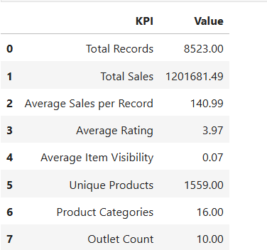
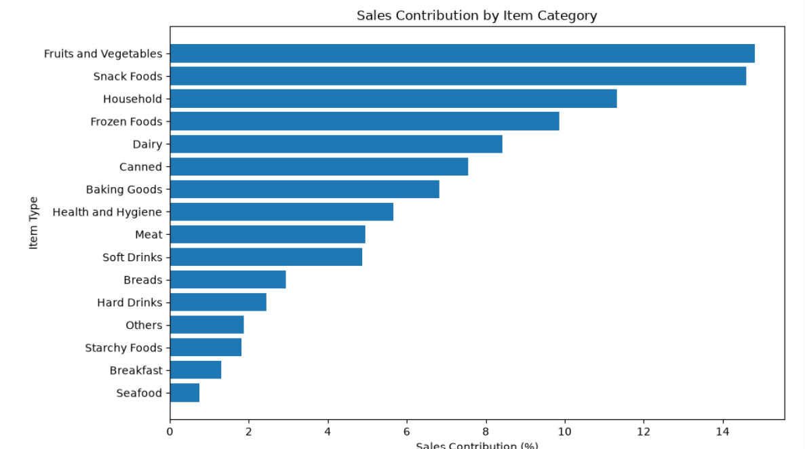
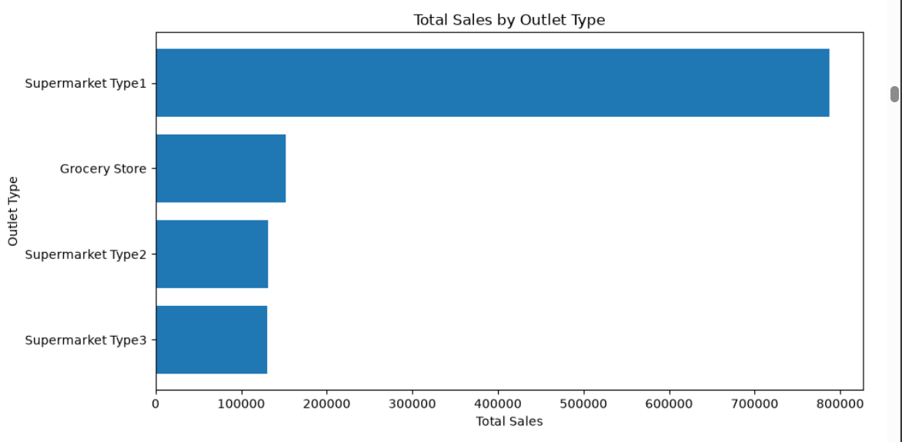
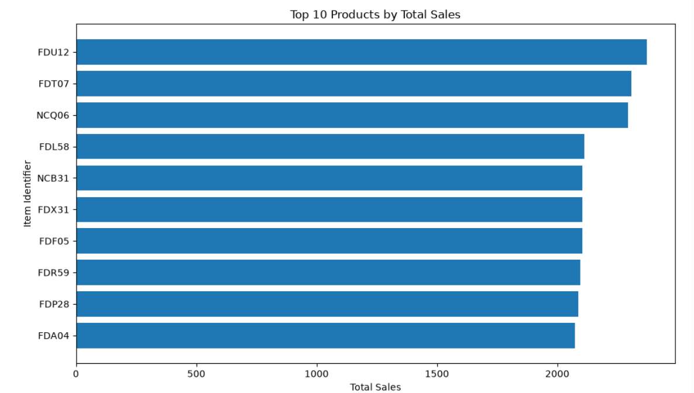
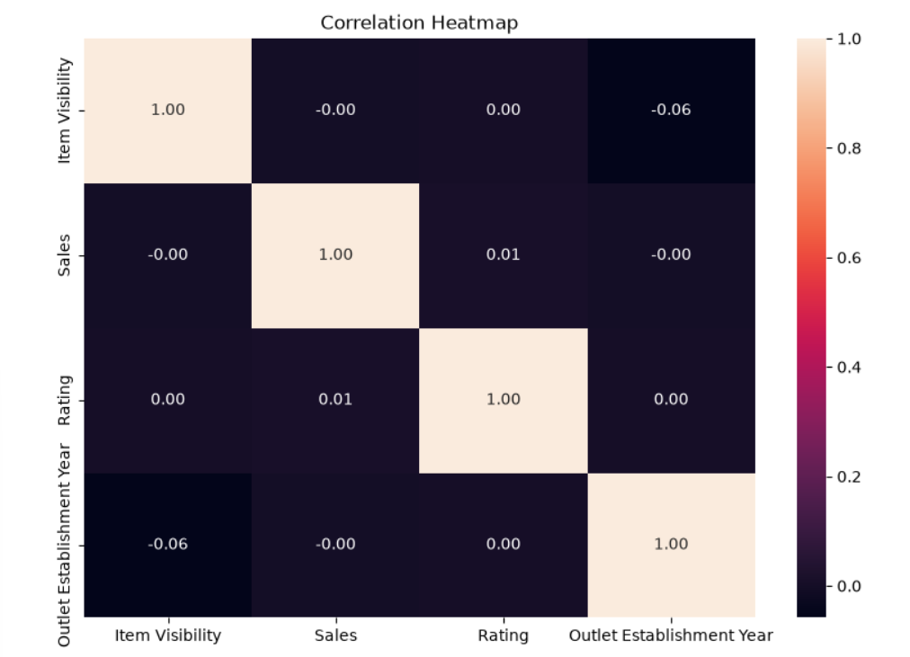

# 🛒 Blinkit Sales & Outlet Performance Analysis

## 📊 SQL + Python Data Analytics Project

An end-to-end data analytics project analyzing Blinkit's grocery sales data to identify **product performance, outlet performance, sales patterns, and key business insights** using **MySQL and Python**.

---

## 🎯 Project Objective

The objective of this project is to analyze Blinkit sales data and answer key business questions such as:

* Which product categories generate the highest sales?
* Which individual products perform best?
* Which outlet types contribute the most sales?
* How does sales performance vary across location tiers?
* Which outlet sizes perform better?
* How do sales vary by item fat content?
* Which outlets are the top performers?
* How does sales performance vary by outlet establishment year?
* How concentrated are sales among top categories and products?

---

## 🛠️ Tools & Technologies

* **MySQL** — Database creation, data cleaning and SQL analysis
* **Python** — Data analysis
* **Pandas** — Data manipulation
* **NumPy** — Numerical analysis
* **Matplotlib** — Visualization
* **Seaborn** — Statistical visualization
* **Jupyter Notebook** — Analysis and documentation
* **GitHub** — Project version control and portfolio

---

## 📁 Project Structure

```text
Blinkit-SQL-Python-Analytics/
│
├── data/
│   └── Blinkit.csv
│
├── sql/
│   └── blinkit_sales_analysis.sql
│
├── python/
│   └── blinkit_sales_analysis.ipynb
│
└── README.md
```

---

## 📦 Dataset Overview

The dataset contains **8,523 sales records** covering grocery products and outlet characteristics.

### Dataset Statistics

| Metric             | Value |
| ------------------ | ----: |
| Total Records      | 8,523 |
| Unique Products    | 1,559 |
| Product Categories |    16 |
| Outlets            |    10 |
| Outlet Types       |     4 |
| Location Tiers     |     3 |

### Key Variables

* Item Fat Content
* Item Identifier
* Item Type
* Outlet Establishment Year
* Outlet Identifier
* Outlet Location Type
* Outlet Size
* Outlet Type
* Item Visibility
* Sales
* Rating

> **Important:** The dataset does not contain Order ID or Customer ID. Therefore, order-level metrics such as Average Order Value (AOV), customer count, and customer-level behavior are not calculated.

---

# 🔄 Project Workflow

```text
Business Problem
      ↓
Data Loading
      ↓
Data Cleaning & Validation
      ↓
Exploratory Data Analysis
      ↓
KPI Analysis
      ↓
SQL Analysis
      ↓
Python Visualization
      ↓
Business Insights
      ↓
Conclusion
```

---

# 🗄️ SQL Analysis

The SQL analysis was performed using MySQL.

### SQL Concepts Used

* Database & table creation
* Data cleaning
* Missing value validation
* Duplicate validation
* Data standardization
* Aggregations
* `GROUP BY`
* `ORDER BY`
* Subqueries
* CTEs
* `RANK()`
* `ROW_NUMBER()`
* `PARTITION BY`
* Percentage contribution analysis
* Business KPI calculations

### Major SQL Analyses

#### 1. KPI Analysis

Calculated:

* Total Sales
* Average Sales per Record
* Average Rating
* Average Item Visibility
* Unique Products
* Product Categories
* Total Outlets
* Outlet Types
* Location Tiers

#### 2. Product Analysis

Analyzed:

* Sales by Item Type
* Top 10 Products
* Sales Contribution by Category
* Sales by Fat Content
* Sales by Rating Band
* Sales by Visibility Band
* Average Sales by Category

#### 3. Outlet Analysis

Analyzed:

* Sales by Outlet Type
* Average Sales by Outlet Type
* Sales by Location Tier
* Sales by Outlet Size
* Outlet Type + Location Tier
* Outlet Performance Ranking
* Top Outlet within Each Location Tier
* Outlet Sales Contribution

#### 4. Business Insights

Analyzed:

* Sales by Establishment Year
* Establishment Year Ranking
* Category + Outlet Type Performance
* Top Category by Location Tier
* Rating vs Sales
* Top Product Sales Contribution

---

# 🐍 Python Analysis

Python was used for exploratory data analysis, visualization and business insight generation.

### Python Workflow

```text
Load Dataset
     ↓
Inspect Data
     ↓
Check Missing Values
     ↓
Check Duplicates
     ↓
Clean Categorical Values
     ↓
Descriptive Statistics
     ↓
EDA
     ↓
KPI Analysis
     ↓
Visualization
     ↓
Business Insights
```

### Visualizations Created

* Sales by Item Type
* Sales by Outlet Type
* Sales by Outlet Location
* Sales by Outlet Size
* Sales by Item Fat Content
* Average Sales by Item Type
* Rating vs Sales
* Item Visibility vs Sales
* Sales Trend by Establishment Year
* Top 10 Products
* Sales Contribution by Category
* Sales Distribution
* Sales by Outlet Type & Location
* Average Sales by Outlet Type
* Correlation Heatmap

---# 📸 Project Analysis

### KPI Summary


### Sales Contribution by Category


### Outlet Performance


### Top 10 Products


### Correlation Analysis



# 📊 Key KPIs

| KPI                      |         Value |
| ------------------------ | ------------: |
| Total Records            |         8,523 |
| Total Sales              | ₹1,201,681.49 |
| Average Sales per Record |       ₹140.99 |
| Average Rating           |          3.97 |
| Average Item Visibility  |        0.0661 |
| Unique Products          |         1,559 |
| Product Categories       |            16 |
| Total Outlets            |            10 |

---

# 💡 Key Business Insights

### 🥦 Product Performance

* **Fruits and Vegetables** generated the highest total sales at approximately **₹178K**.
* **Snack Foods** ranked second in total sales.
* **Household** recorded the highest average sales per record among product categories.
* The top 3 categories — Fruits and Vegetables, Snack Foods and Household — contributed approximately **40.74% of total sales**.

### 🏪 Outlet Performance

* **Supermarket Type1** generated the highest total sales and contributed approximately **65.54% of total sales**.
* **Supermarket Type2** recorded the highest average sales per record among outlet types.
* **Tier 3** generated the highest total sales among location tiers.
* **Medium-sized outlets** generated the highest total sales.
* **High-sized outlets** had the highest average sales per record.

### 🧈 Product Characteristics

* Low Fat products generated higher total sales than Regular products, partly because Low Fat records are more numerous.
* Higher-rated records do not automatically imply higher sales; the analysis shows association rather than causation.
* Item visibility does not show a simple strong linear relationship with sales.

### 📅 Outlet Establishment

* Outlets established in **2018** generated the highest total sales.
* **2017** recorded the highest average sales per record.
* Establishment-year comparisons should be interpreted alongside record volume.

---

# 🎯 Business Takeaway

The analysis shows that Blinkit's sales are concentrated across a few major product categories and outlet formats.

**Fruits and Vegetables, Snack Foods and Household** are important contributors to product-level sales, while **Supermarket Type1** is the dominant outlet format.

However, total sales should always be interpreted alongside **record count and average sales per record** to avoid misleading conclusions.

---

# 📌 Important Analytical Note

The dataset represents **record-level sales values**, not individual customer orders.

Therefore, this project intentionally avoids unsupported metrics such as:

* Average Order Value
* Customer Lifetime Value
* Customer Count
* Repeat Customer Rate
* Order Frequency

This ensures that the analysis remains consistent with the available dataset structure.

---

# 🚀 Skills Demonstrated

### SQL

`MySQL` · `CTEs` · `Window Functions` · `RANK()` · `ROW_NUMBER()` · `PARTITION BY` · `Aggregations` · `Subqueries` · `Data Cleaning`

### Python

`Python` · `Pandas` · `NumPy` · `Matplotlib` · `Seaborn` · `Jupyter Notebook`

### Analytics

`Data Cleaning` · `EDA` · `KPI Analysis` · `Business Analysis` · `Data Visualization` · `Insight Generation`

---

# 👨‍💻 Project Outcome

This project demonstrates an end-to-end **Data Analyst workflow**, from raw data validation and cleaning to SQL analysis, Python visualization and business insight generation.

It is designed to demonstrate practical skills required for entry-level **Data Analyst / Business Analyst** roles.
